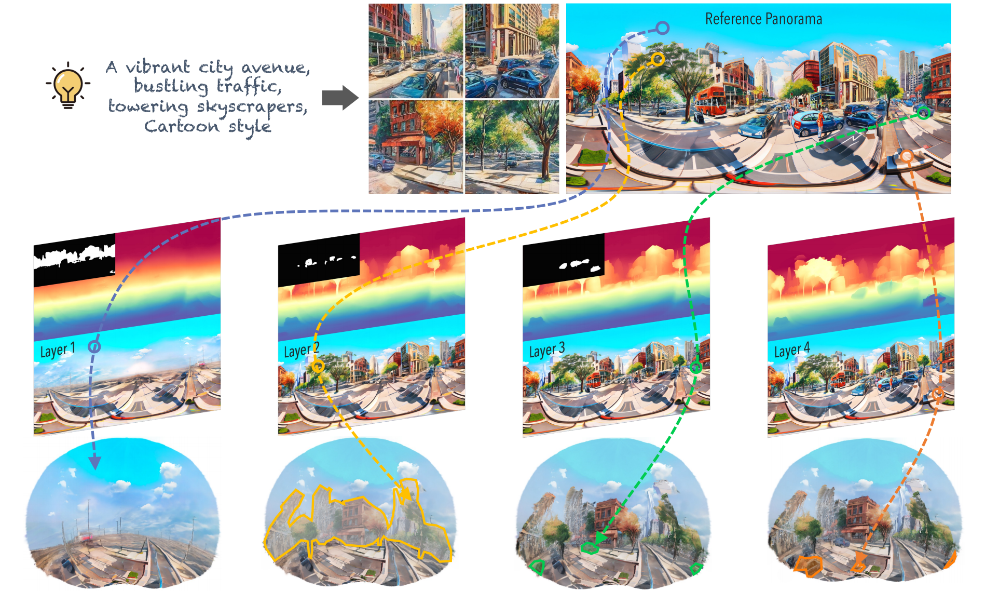

# LayerPano3D: Layered 3D Panorama for Hyper-Immersive Scene Generation


[**Project page**](https://ys-imtech.github.io/projects/LayerPano3D/) | [**Paper**](https://arxiv.org/abs/2312.04543)


</br>

[Shuai Yang*](https://ys-imtech.github.io/), 
[Jing Tan*](https://sparkstj.github.io/), 
[Mengchen Zhang](https://github.com/kszpxxzmc/), 
[Tong Wu✉️](https://wutong16.github.io/), 
[Yixuan Li](https://yixuanli98.github.io/), 
[Gordon Wetzstein](https://stanford.edu/~gordonwz/), 
[Ziwei Liu](https://liuziwei7.github.io/), 
[Dahua Lin✉️](http://dahua.me/)

<p style="font-size: 0.6em; margin-top: -1em">*Equal Contribution,   ✉️Corresponding author</p>


<p align="center">
<a href="https://arxiv.org/abs/2312.04543">"></a>
<a href="https://ys-imtech.github.io/projects/LayerPano3D/"></a>
<a href="https://www.youtube.com/watch?v=dXvoFRbHOiw"></a>
<a href="" target='_blank'>

</a>
</p>


<!-- 
<video class="video img-fluid" loop autoplay muted>
    <source src="assets/web_case_video.mp4" />
</video> -->



## 👨‍💻 Todo
- [ ] Release Code (Coming soon !!! )


<!-- ## ✒️ Citation
If you find our work helpful for your research, please consider giving a star ⭐ and citation 📝

```bibtex

}
``` -->
